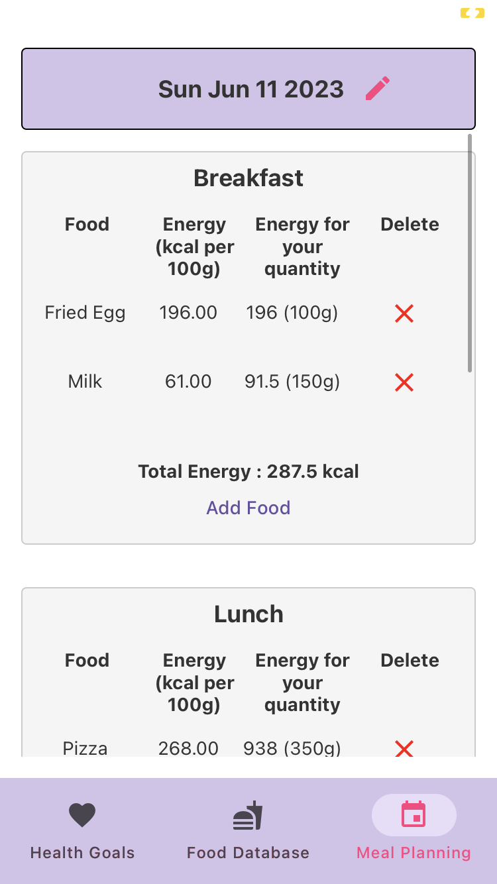

# ProjetMobilEsiee
***
Equipe : ESCAFFRE Robin et TADRES Nicolas E4FI Groupe 3I

## Description
*** 
This application calculates the number of calories per day for a person according to certain parameters (age, weight, height, etc.), and searches for information on foods such as calorie count, protein, etc. Finally, it lets you plan your meals for each day, so you can get a summary of the number of calories consumed per day to help you reach your goal.

## Installation
***

1. Clone project
```
$ git clone https://github.com/tadresn/ProjetMobilEsiee.git
```

2. Install dependencies
```
$ npm install
```

3. Start project
```
$ npx expo start
```

## How to use it
***
1. You can calculate the number of calories you need by filling in the form on this screen.


2. You can choose which dish to eat with this screen.


3. You have a summary of your dishes per day that you can modify.


